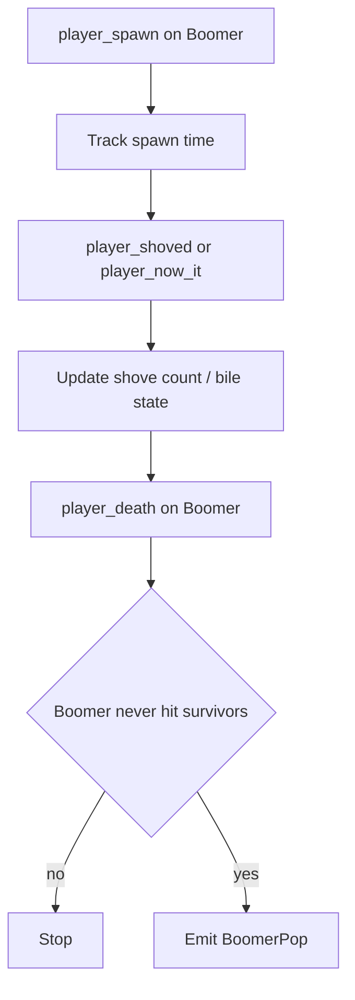
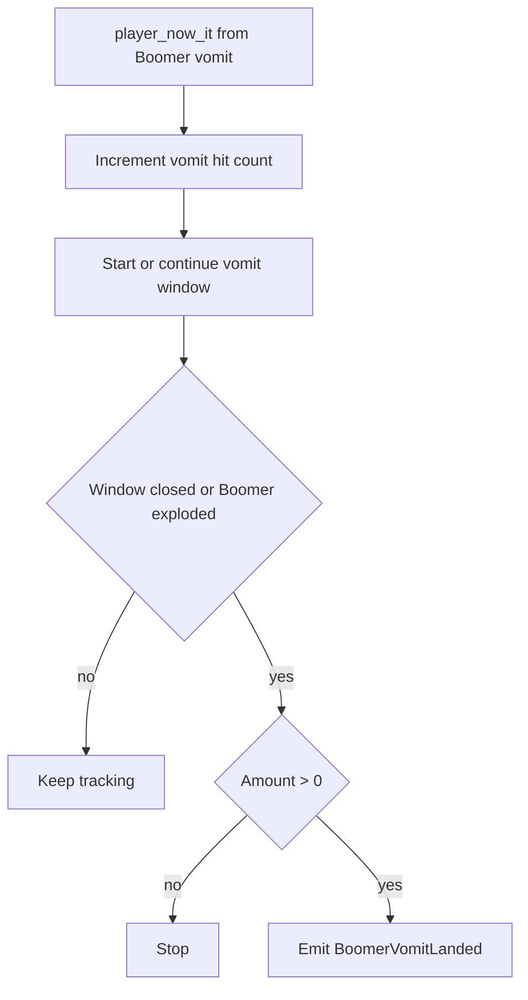

# Boomer Flows

Este documento resume los flujos actuales de skills relacionadas con `Boomer`.

## Skills

- `BoomerPop`
- `BoomerVomitLanded`

## BoomerPop

### Sources

- `player_spawn`
- `player_shoved`
- `player_now_it`
- `boomer_exploded`
- `player_death`

### State

- `g_fDetectBoomerSpawnTime`
- `g_bDetectBoomerHitSomebody`
- `g_iDetectBoomerShoveCount`

### Emit

Se emite `BoomerPop` cuando:

- el `Boomer` muere,
- no logró vomitar ni explotar sobre survivors,
- y la kill final viene del survivor que lo poppeó.

### Properties

- `shove_count`
- `time_a`

### Flow

## BoomerVomitLanded

### Sources

- `player_now_it`
- `boomer_exploded`
- timer de cierre de ventana de vomit

### State

- `g_iDetectBoomerVomitHits`

Ventana:

- `L4D2_SKILLS_BOOMER_VOMIT_WINDOW`

### Emit

Se emite `BoomerVomitLanded` cuando:

- el `Boomer` conecta vomit directo,
- el detector acumula la cantidad de survivors afectados,
- y la ventana de vomit se cierra con al menos un impacto válido.

No se usa para explosión del `Boomer`; solo para vomit directo.

### Properties

- `amount`

### Flow

