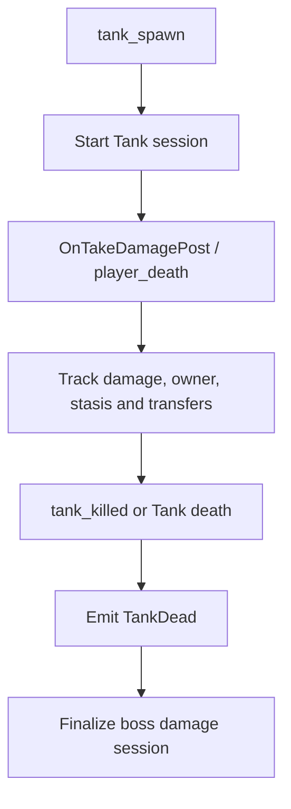
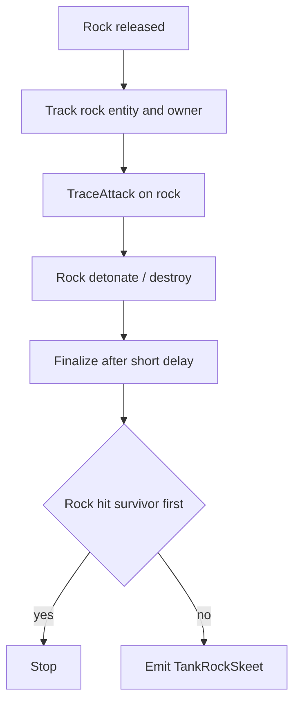
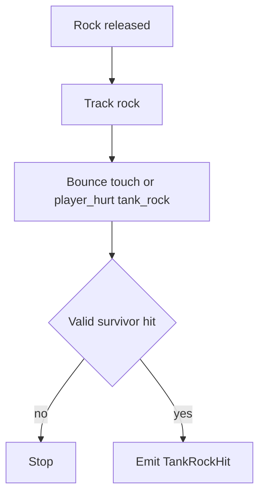
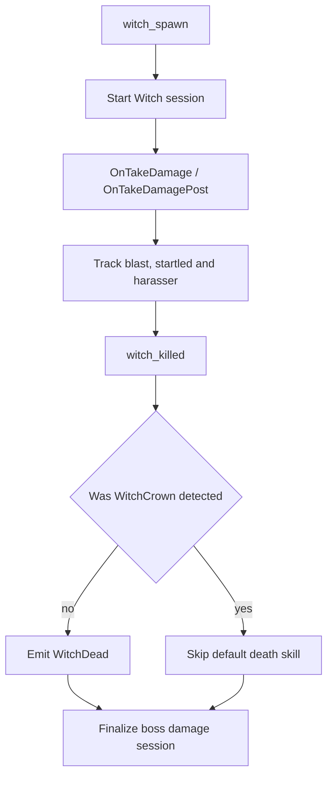
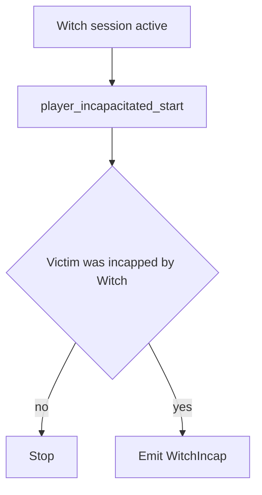

# Boss Flows

Este documento resume los flujos actuales de skills y sesiones relacionadas con `Tank` y `Witch`.

## Skills and Sessions

- `TankDead`
- `TankRockSkeet`
- `TankRockHit`
- `WitchDead`
- `WitchCrown`
- `WitchIncap`
- boss damage sessions de `Tank`
- boss damage sessions de `Witch`

## Tank Damage Session

### Sources

- `tank_spawn`
- `SDKHook_OnTakeDamagePost`
- `player_death`
- `tank_killed`
- `L4D_OnReplaceTank`
- `L4D_OnTryOfferingTankBot`
- `L4D_OnTryOfferingTankBot_Post`
- `L4D_OnTryOfferingTankBot_PostHandled`
- `L4D_OnEnterStasis`
- `L4D_OnLeaveStasis`

### State

- `g_BossSessions`
- `g_BossDamage`
- `g_Runtime.hasTankControlEq`
- common session:
  - `maxHealth`
  - `lastHealth`
  - `totalDamage`
- `tank` substate:
  - `inStasis`
  - `endReason`
  - `controlCount`
  - `activeControlIndex`
  - `controls[]`

Cada entrada de `controls[]` guarda:

- identidad persistente del controller
- `controlTime`
- `rocksThrown`
- `rocksHit`
- `overflow`
- `mergedControls`

Regla de ownership:

- cada `Tank` vive en su propia boss session;
- el payload público ya no depende de un único `owner`;
- la identidad pública del `Tank` vive en `tank_control`;
- cualquier métrica nueva de `Tank` debe agregarse por sesión o por segmento de control, no como contador global;
- el diseño actual admite múltiples `Tank` simultáneos siempre que el tracking siga resolviendo por `victim`, `userid`, `entity` o `rock owner`.

Fuente de control:

- si `l4d_tank_control_eq` está cargado
  - `PlayerSkills` usa esa librería como fuente preferida de continuidad del `Tank`;
  - consume:
    - `TankControl_GetClientTankId(...)`
    - `TankControl_OnTankControlChanged(...)`
  - y reduce sus heurísticas locales de reasignación;
- si no está cargado
  - `PlayerSkills` cae a su lógica local de recuperación:
    - bot reclaim
    - human takeover
  - en este modo no intenta rehidratar al mismo humano por identidad persistente;
  - si el flujo no matchea por `userid`, `client`, reclaim bot o takeover humano, se abre una sesión nueva.

### Emit

`TankDead` se emite cuando:

- el `Tank` muere,
- la sesión del boss sigue siendo válida,
- y existe killer survivor para el evento.

La sesión de daño se finaliza aparte para el resumen de boss.

Regla de identidad pública:

- `TankDead` ya no expone `victim_*`;
- la identidad pública del `Tank` debe leerse desde `boss_session.tank_control`.

### Properties

`TankDead` no necesita `skill_properties` especiales.

Contexto adicional:

- `tank_session`
  - `in_stasis`
  - `end_reason`
- `boss_session`
  - se puede inspeccionar completo con `PlayerSkills_FillBossSessionKeyValues(...)`
  - incluye:
    - estado común
    - `damage_entries`
    - `tank_control_count`
    - `tank_control[]`

Regla de KV público:

- `rocks_thrown` y `rocks_hit`
  - ya no viven en `tank_session`;
- ahora viven en cada segmento de `tank_control`;
- el summary de announce del `Tank`
  - deriva el total sumando todos los segmentos.

Reglas de segmentación:

- si el control pasa de un humano a otro humano distinto
  - se abre un nuevo segmento;
- si el control pasa de humano a bot y luego vuelve el mismo humano
  - el tramo bot se absorbe en el segmento humano original;
- si el historial supera el máximo de segmentos
  - el último slot se reutiliza como `overflow`;
  - ese slot expone `overflow = 1`;
  - y `merged_controls` indica cuántos controles quedaron compactados ahí.

### Tank Session Close

Forward disponible:

```sourcepawn
forward void PlayerSkills_OnTankSessionClosed(int sessionId, L4D2TankSessionEndReason reason);
```

Reasons actuales:

- `TankDead`
- `SurvivorsEscaped`
- `SurvivorsWiped`

### Flow



## TankRockSkeet

### Sources

- `L4D_TankRock_OnRelease_Post`
- `SDKHook_TraceAttack` on rock
- `L4D_TankRock_OnDetonate`
- `OnEntityDestroyed`

### State

- `g_DetectRocks`

Por roca:

- owner `Tank`
- `totalDamage`
- `lastShooter`
- `touched`
- `hit`
- `finalizeQueued`
- `releasedAt`

### Emit

Se emite `TankRockSkeet` cuando:

- una roca activa recibe daño de survivor,
- no llegó a tocar survivor antes de resolverse,
- y el cierre diferido confirma que no fue realmente un hit.

Nombre visible:

- `Skeet-Rock`

### Properties

No agrega `skill_properties` especiales hoy.

### Flow



## TankRockHit

### Sources

- `L4D_TankRock_BounceTouch_Post`
- `player_hurt` with `tank_rock`

### State

Comparte el tracking de roca con `TankRockSkeet`.

### Emit

Se emite `TankRockHit` cuando:

- la roca conecta survivor,
- o el daño `tank_rock` confirma el impacto dentro del flujo activo de esa roca.

### Properties

No agrega `skill_properties` especiales hoy.

### Flow



## Witch Damage Session

### Sources

- `witch_spawn`
- `SDKHook_OnTakeDamage`
- `SDKHook_OnTakeDamagePost`
- `witch_killed`
- `player_incapacitated_start`
- `L4D_OnWitchSetHarasser`

### State

- `g_BossSessions`
- `g_BossDamage`
- common session:
  - `totalDamage`
- `witch` substate:
  - `startled`
  - `harasser`
  - `incapVictim`
  - `crownDetected`
  - `crowner`
  - `lastHealthBeforeDamage`
  - `lastShotAttacker`
  - `lastShotDamage`
  - `lastShotRawDamage`
  - `lastDamageType`
  - `lastShotIsShotgun`
  - `lastBlastStartTime`
  - `lastBlastDamage`
  - `lastBlastRawDamage`
  - death pending state

Regla de ownership:

- cada `Witch` vive en su propia boss session;
- el estado fino de `crown`, `startle`, `harasser` e `incapVictim` debe permanecer aislado por entidad/session;
- el payload público de `Witch` no usa identidad de controller;
- el diseño actual admite múltiples `Witch` simultáneas siempre que el tracking siga resolviendo por entidad.

### Emit

`WitchDead` se emite cuando:

- la `Witch` muere,
- el killer es survivor,
- y no hubo `WitchCrown`.

`WitchDead` no representa una skill; es el cierre default que imprime el resumen tradicional de daño.

Regla de daño:

- `lastShotDamage` y `lastBlastDamage`
  - guardan daño efectivo capeado por la vida restante de la `Witch`;
- `lastShotRawDamage` y `lastBlastRawDamage`
  - se conservan solo como contexto técnico;
- el payload final de `WitchDead`
  - expone contexto de cierre de sesión, no una skill de crown.

Regla de announce:

- `WitchDead`
  - imprime el resumen tradicional de daño hecho a la `Witch`.

Regla de KV público:

- `WitchCrown`
  - omite `victim_*`
  - mantiene `actor_weaponid`
- `WitchDead`
  - omite `victim_*`
  - omite `actor_weaponid`
- `witch_session`
  - mantiene:
    - `startled`
    - `crown_detected`
  - no expone identidad de controller
- `damage_entries`
  - no expone `weaponid`
  - porque una misma sesión de `Witch` puede mezclar varias armas por survivor

### Round End Policy

El timer diferido de muerte de `Witch` usa política de `hard stop`.

Si la ronda deja de estar `live` antes de resolver:

- no se emite `WitchCrown`;
- no se emite `WitchDead`;
- no se imprime el cierre diferido de la sesión.

### Properties

- `damage`
- `actor_damage`
- `chip_damage`
- `shots`
- `startled`

Contexto adicional:

- `witch_session`

### Flow



## WitchCrown

### Sources

- `witch_killed`
- Witch damage session state

### State

Reutiliza la misma sesión de `Witch`:

- contributors de daño por survivor
- `lastShotDamage`
- `lastBlastDamage`
- `lastShotRawDamage`
- `lastBlastRawDamage`
- `lastShotIsShotgun`
- `pendingWitchOneShot`
- `pendingWitchMeleeOnly`

### Emit

`WitchCrown` se emite cuando la muerte de la `Witch` clasifica como crown.

### Properties

- `damage`
- `actor_damage`
- `chip_damage`
- `shots`
- `crown`
- `perfect`
- `startled`

Contexto adicional:

- `witch_session`

## WitchIncap

### Sources

- `player_incapacitated_start`

### State

Comparte la sesión activa de `Witch`.

### Emit

Se emite `WitchIncap` cuando:

- una `Witch` activa incapacita a un survivor,
- y la sesión del boss sigue abierta.

### Properties

- `amount`
- `startled`

Contexto adicional:

- `witch_session`

### Flow


