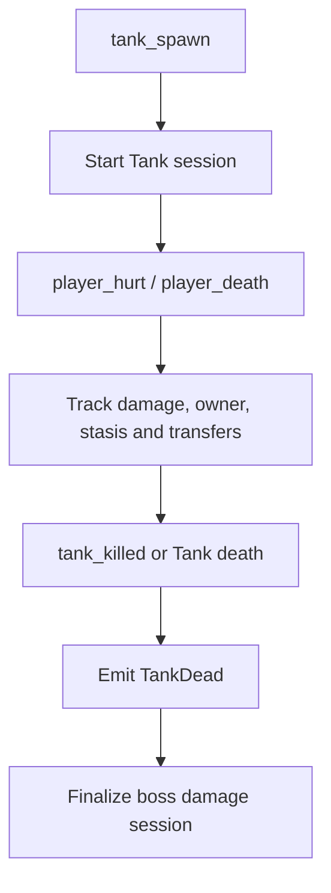
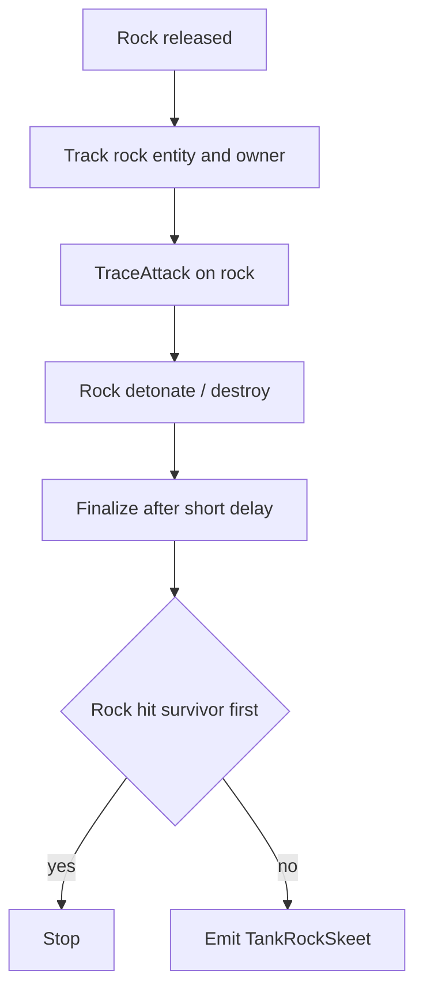
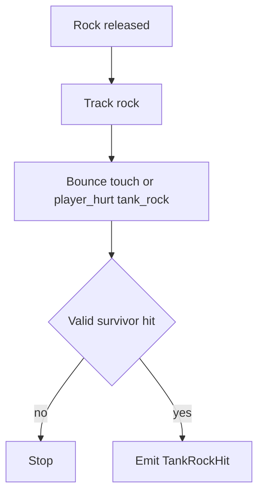
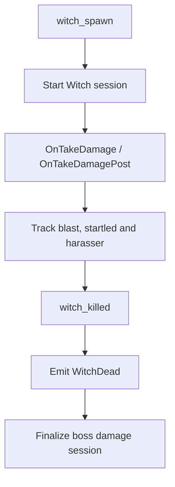
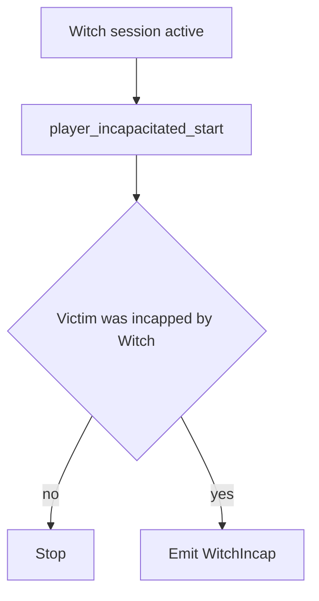

# Boss Flows

Este documento resume los flujos actuales de skills y sesiones relacionadas con `Tank` y `Witch`.

## Skills and Sessions

- `TankDead`
- `TankRockSkeet`
- `TankRockHit`
- `WitchDead`
- `WitchIncap`
- boss damage sessions de `Tank`
- boss damage sessions de `Witch`

## Tank Damage Session

### Sources

- `tank_spawn`
- `player_hurt`
- `player_death`
- `tank_killed`
- `L4D_OnReplaceTank`
- `L4D_OnTryOfferingTankBot`
- `L4D_OnTryOfferingTankBot_Post`
- `L4D_OnTryOfferingTankBot_PostHandled`
- `L4D_OnEnterStasis`
- `L4D_OnLeaveStasis`

### State

- `g_BossSessions`
- `g_BossDamage`
- owner actual
- pending owner
- `inStasis`
- `maxHealth`
- `lastHealth`
- `totalDamage`
- `rocksThrown`
- `rocksHit`
- `incaps`
- `kills`

### Emit

`TankDead` se emite cuando:

- el `Tank` muere,
- la sesión del boss sigue siendo válida,
- y existe killer survivor para el evento.

La sesión de daño se finaliza aparte para el resumen de boss.

### Properties

`TankDead` no necesita `skill_properties` especiales.

Contexto adicional:

- `tank_session`

### Flow

## TankRockSkeet

### Sources

- `L4D_TankRock_OnRelease_Post`
- `SDKHook_TraceAttack` on rock
- `L4D_TankRock_OnDetonate`
- `OnEntityDestroyed`

### State

- `g_DetectRocks`

Por roca:

- owner `Tank`
- `totalDamage`
- `lastShooter`
- `touched`
- `hit`
- `finalizeQueued`
- `releasedAt`

### Emit

Se emite `TankRockSkeet` cuando:

- una roca activa recibe daño de survivor,
- no llegó a tocar survivor antes de resolverse,
- y el cierre diferido confirma que no fue realmente un hit.

### Properties

No agrega `skill_properties` especiales hoy.

### Flow

## TankRockHit

### Sources

- `L4D_TankRock_BounceTouch_Post`
- `player_hurt` with `tank_rock`

### State

Comparte el tracking de roca con `TankRockSkeet`.

### Emit

Se emite `TankRockHit` cuando:

- la roca conecta survivor,
- o el daño `tank_rock` confirma el impacto dentro del flujo activo de esa roca.

### Properties

No agrega `skill_properties` especiales hoy.

### Flow

## Witch Damage Session

### Sources

- `witch_spawn`
- `SDKHook_OnTakeDamage`
- `SDKHook_OnTakeDamagePost`
- `witch_killed`
- `player_incapacitated_start`
- `L4D_OnWitchSetHarasser`

### State

- `g_BossSessions`
- `g_BossDamage`
- `startled`
- `harasser`
- `lastHealthBeforeDamage`
- `lastShotAttacker`
- `lastShotDamage`
- `lastShotRawDamage`
- `lastDamageType`
- `lastShotIsShotgun`
- `lastBlastStartTime`
- `lastBlastDamage`
- `lastBlastRawDamage`

### Emit

`WitchDead` se emite cuando:

- la `Witch` muere,
- el killer es survivor,
- y la sesión de boss sigue siendo válida.

El contexto `crown` se decide sobre el blast final acumulado.

### Properties

- `damage`
- `chip_damage`
- `shots`
- `crown`
- `startled`

Contexto adicional:

- `witch_session`

### Flow

## WitchIncap

### Sources

- `player_incapacitated_start`

### State

Comparte la sesión activa de `Witch`.

### Emit

Se emite `WitchIncap` cuando:

- una `Witch` activa incapacita a un survivor,
- y la sesión del boss sigue abierta.

### Properties

- `amount`
- `startled`

Contexto adicional:

- `witch_session`

### Flow

