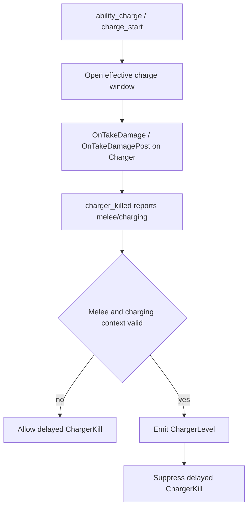
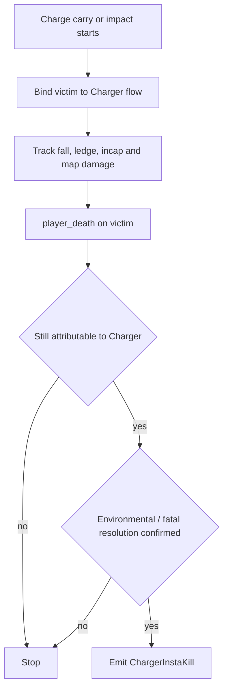
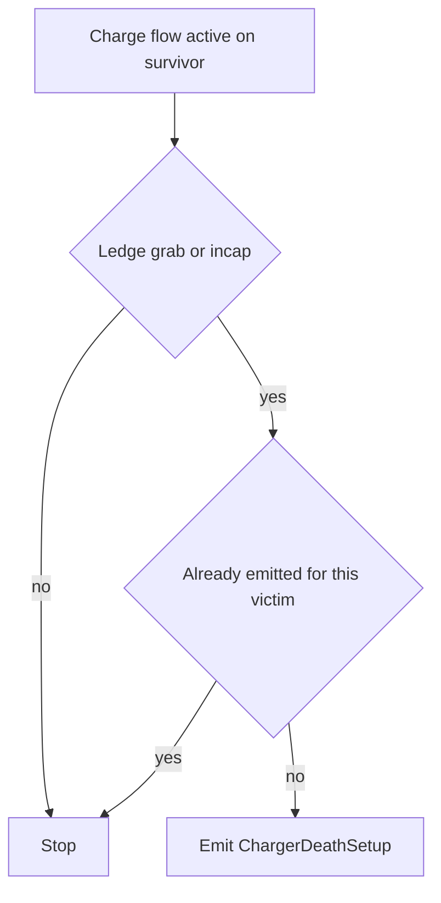
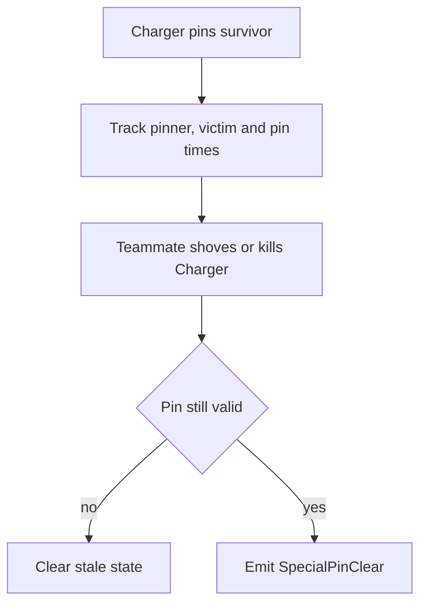

# Charger Flows

Este documento resume los flujos actuales de skills relacionadas con `Charger`.

## Skills

- `ChargerLevel`
- `ChargerInstaKill`
- `ChargerDeathSetup`
- `SpecialPinClear` en el contexto de `Charger`

## ChargerLevel

### Sources

- `player_hurt`
- `player_death`
- `SDKHook_OnTakeDamage`
- `SDKHook_OnTakeDamagePost`

`player_hurt` queda solo como contexto complementario. El daño canónico usado por `ChargerLevel` se captura desde `SDKHook_OnTakeDamagePost`.

La muerte genérica de `Charger` ya no debe ganarle a `ChargerLevel`.
El flujo actual difiere el `ChargerKill` un tick corto para dejar que la
clasificación rica de `Level` se resuelva primero.

### State

- `g_DetectChargerDamageSnapshot`
- `g_bDetectChargerCharging`
- `g_fDetectChargerChargeSeenAt`
- `g_bDetectChargerKilledMelee`
- `g_bDetectChargerKilledCharging`
- `g_bDetectPendingChargerDeathEval`
- `g_iDetectPendingChargerDeathAttackerUserId`

Fuentes auxiliares de verdad para charge:

- `ability_use` con `ability_charge`
- `charger_charge_start`
- `charger_charge_end`
- `charger_killed`

### Emit

Se emite `ChargerLevel` cuando:

- el `Charger` muere por melee,
- seguía en `charge` o el juego reporta que murió `charging`,
- y el golpe final cumple el umbral tecnico de `level`.

### Properties

- `damage`
- `chip_damage`
- `perfect`

Notas:

- `chip_damage` sigue existiendo como dato tecnico del evento;
- el announce visible ya no usa wording explicito de `chip`;
- si hubo daño previo propio del actor, el chat imprime `Level ... (dmg/shots)`;
- si hubo asistencia previa, el chat imprime `Level ..., asistido por ...`;
- `PerfectLevel` reemplaza al `Level` limpio y ocupa su lugar en chat.

### Flow

## ChargerInstaKill

### Sources

- `L4D2_OnStartCarryingVictim_Post`
- `charger_impact`
- `L4D2_OnSlammedSurvivor_Post`
- `L4D_OnFatalFalling`
- `L4D_OnFalling`
- `L4D_OnIncapacitated_Post`
- `player_incapacitated_start`
- `L4D_OnLedgeGrabbed_Post`
- `player_hurt`
- `player_death`

### State

- `g_iDetectChargeOwner`
- `g_bDetectChargeWasCarried`
- `g_fDetectChargeStartTime`
- `g_fDetectChargeOrigin`
- `g_iDetectChargeFlags`
- `g_iDetectChargeMapDamage`
- `g_fDetectChargeLastMapDamageTime`
- `g_fDetectChargeIncapTime`

Flags relevantes:

- `DCFLAG_FALL`
- `DCFLAG_DROWN`
- `DCFLAG_TRIGGER`
- `DCFLAG_HURTLOTS`
- `DCFLAG_AIRDEATH`
- `DCFLAG_KILLEDBYOTHER`
- `DCFLAG_DEADLY`
- `DCFLAG_INCAP`
- `DCFLAG_LEDGE`

### Emit

Se emite `ChargerInstaKill` cuando:

- un survivor queda asociado al flujo de `charge`,
- la muerte final ocurre dentro de la ventana atribuible,
- la muerte viene del desplazamiento, caída, trigger, drown o daño de mapa del flujo,
- y el último infectado responsable sigue siendo el `Charger`.

No se emite si otro SI se vuelve el causante principal de la muerte.

### Properties

- `zombie_class`
- `height`
- `distance`
- `was_carried`
- `damage`
- `incapped`
- `fatal_fall`
- `deadly_slam`

### Internal Terms

Estos conceptos deben mantenerse como nombres tecnicos en codigo y API:

- `ledge_hang`
  - el survivor termina colgando del borde
- `deadly_slam`
  - el survivor muere por el golpe/estrellon de la carga
- `fatal_fall`
  - el survivor muere por la caida posterior al desplazamiento del Charger

En chat no hace falta exponer esos nombres literalmente. El announce debe priorizar el resultado visible:

- `deadly_slam` -> "estrellandolo hasta matarlo"
- `fatal_fall` -> "haciendolo caer hasta matarlo"

`ledge_hang` ya no forma parte de `ChargerInstaKill`; hoy vive como skill separada
en `ChargerLedgeHang`.

### Flow

## ChargerLedgeHang

### Sources

- `L4D_OnLedgeGrabbed_Post`
- `L4D_OnIncapacitated_Post`
- `player_incapacitated_start`

### State

Comparte el tracking de victima de `ChargerInstaKill` y ademas usa:

- `g_bDetectChargeSetupEmitted`

### Emit

Se emite `ChargerLedgeHang` cuando el `Charger` deja a un survivor:

- colgando del borde

sin mezclar ese resultado con una muerte ni con un `InstaKill`.

### Properties

- `zombie_class`
- `was_carried`
- `ledge_hang`

## ChargerDeathSetup

### Sources

- `L4D_OnLedgeGrabbed_Post`
- `L4D_OnIncapacitated_Post`
- `player_incapacitated_start`

### State

Comparte el tracking de víctima de `ChargerInstaKill` y además usa:

- `g_bDetectChargeSetupEmitted`

### Emit

Se emite `ChargerDeathSetup` cuando el `Charger` deja a un survivor:

- incapacitado,

sin mezclar ese resultado con una muerte confirmada.

### Properties

- `zombie_class`
- `was_carried`
- `incapped`

### Internal Terms

Para `ChargerDeathSetup`:

- `incapped`
  - debe entenderse como survivor incapacitado sin muerte confirmada del flujo

### Flow

## SpecialPinClear with Charger

### Sources

- `L4D2_OnStartCarryingVictim_Post`
- `L4D2_OnPummelVictim_Post`
- `charger_carry_end`
- `player_shoved`
- `player_death`

### State

- `g_iDetectPinnedVictim`
- `g_iDetectPinnerByVictim`
- `g_iDetectPinnedClass`
- `g_fDetectSpecialClearTimeA`
- `g_fDetectSpecialClearTimeB`

Validación adicional actual:

- `L4D2_GetSurvivorVictim`
- `L4D2_IsInQueuedPummel`
- `L4D2_GetQueuedPummelVictim`

### Emit

Se emite `SpecialPinClear` cuando un teammate:

- shovea o mata al `Charger`,
- el `Charger` seguía pinneando de forma válida,
- y el survivor salvado no es el mismo `clearer`.

### Properties

- `zombie_class`
- `time_a`
- `time_b`
- `with_shove`
- `pinvictim_*`

### Flow

