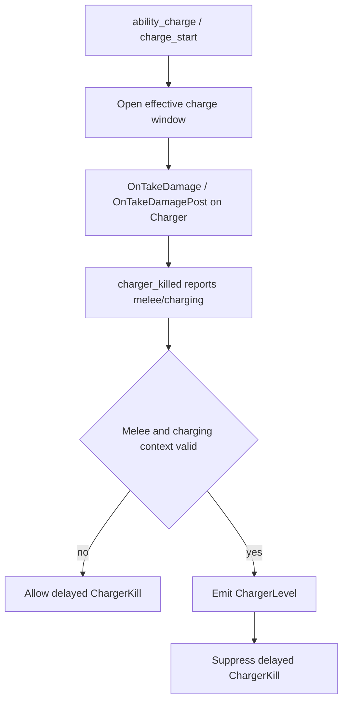
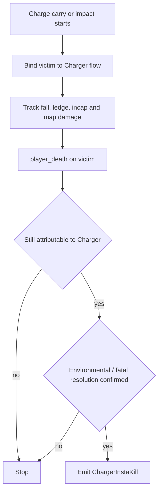
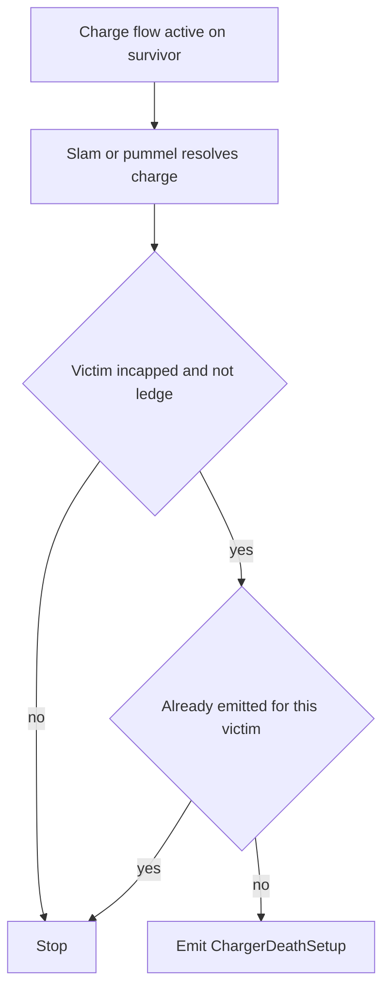
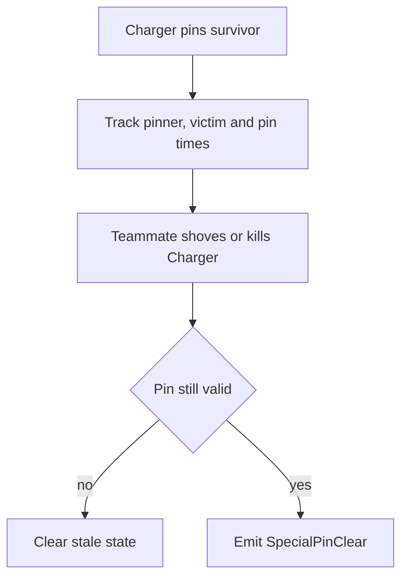

# Charger Flows

Este documento resume los flujos actuales de skills relacionadas con `Charger`.

## Skills

- `ChargerLevel`
- `ChargerInstaKill`
- `ChargerDeathSetup`
- `ChargerClawSummary`
- `SpecialPinClear` en el contexto de `Charger`

## ChargerLevel

### Sources

- `player_hurt`
- `player_death`
- `SDKHook_OnTakeDamage`
- `SDKHook_OnTakeDamagePost`

`player_hurt` queda solo como contexto complementario. El daño canónico usado por `ChargerLevel` se captura desde `SDKHook_OnTakeDamagePost`.

La muerte genérica de `Charger` ya no debe ganarle a `ChargerLevel`.
El flujo actual difiere el `ChargerKill` un tick corto para dejar que la
clasificación rica de `Level` se resuelva primero.

### State

- `g_DetectChargerDamageSnapshot`
- `g_bDetectChargerCharging`
- `g_fDetectChargerChargeSeenAt`
- `g_bDetectChargerKilledMelee`
- `g_bDetectChargerKilledCharging`
- `g_DetectPendingChargerDeath`

Fuentes auxiliares de verdad para charge:

- `ability_use` con `ability_charge`
- `charger_charge_start`
- `charger_charge_end`
- `charger_killed`

### Emit

Se emite `ChargerLevel` cuando:

- el `Charger` muere por melee,
- seguía en `charge` o el juego reporta que murió `charging`,
- y el golpe final cumple el umbral tecnico de `level`.

### Properties

- `damage`
- `chip_damage`
- `perfect`

Notas:

- `chip_damage` sigue existiendo como dato tecnico del evento;
- `damage` y `actor_damage` deben representar daño efectivo de la jugada, no
  `raw damage` inflado del melee final;
- el announce visible ya no usa wording explicito de `chip`;
- si hubo daño previo propio del actor, el chat imprime `Level ... (dmg/shots)`;
- si hubo asistencia previa, el chat imprime `Level ..., asistido por ...`;
- `Level (Perfecto)` reemplaza al `Level` limpio y ocupa su lugar en chat.

### Flow

## ChargerInstaKill

### Sources

- `L4D2_OnStartCarryingVictim_Post`
- `charger_impact`
- `L4D2_OnSlammedSurvivor_Post`
- `L4D2_OnPummelVictim_Post`
- `L4D_OnFatalFalling`
- `L4D_OnFalling`
- `L4D_OnIncapacitated_Post`
- `player_incapacitated_start`
- `L4D_OnLedgeGrabbed_Post`
- `player_hurt`
- `player_death`

### State

- `g_iDetectChargeOwner`
- `g_bDetectChargeWasCarried`
- `g_fDetectChargeStartTime`
- `g_fDetectChargeOrigin`
- `g_iDetectChargeFlags`
- `g_iDetectChargeMapDamage`
- `g_fDetectChargeLastMapDamageTime`
- `g_fDetectChargeIncapTime`
- `g_bDetectChargeSlamResolved`
- `g_DetectChargeAssister`

Flags relevantes:

- `DCFLAG_FALL`
- `DCFLAG_DROWN`
- `DCFLAG_TRIGGER`
- `DCFLAG_HURTLOTS`
- `DCFLAG_AIRDEATH`
- `DCFLAG_KILLEDBYOTHER`
- `DCFLAG_DEADLY`
- `DCFLAG_INCAP`
- `DCFLAG_LEDGE`

### Emit

Se emite `ChargerInstaKill` cuando:

- un survivor queda asociado al flujo de `charge`,
- la muerte final ocurre dentro de la ventana atribuible,
- la muerte viene del desplazamiento, caída, trigger, drown o daño de mapa del flujo,
- y el último infectado responsable sigue siendo el `Charger`.

No se emite si otro SI se vuelve el causante principal de la muerte.

Si existe un infected distinto del `Charger` que estaba dominando o pinneando a
la víctima al abrirse la secuencia, esa identidad puede quedar como `assist` del
`ChargerInstaKill`.

### Properties

- `height`
- `distance`
- `damage`
- `incapped`
- `fatal_fall`
- `deadly_slam`

### Internal Terms

Estos conceptos deben mantenerse como nombres tecnicos en codigo y API:

- `ledge_hang`
  - el survivor termina colgando del borde
- `deadly_slam`
  - el survivor muere por el golpe/estrellon de la carga
- `fatal_fall`
  - el survivor muere por la caida posterior al desplazamiento del Charger
- `was_carried`
  - la víctima principal fue la cargada por el `Charger`
  - no forma parte del contrato público actual, pero sí se usa para el wording del announce

En chat no hace falta exponer esos nombres literalmente. El announce debe priorizar el resultado visible:

- `deadly_slam` -> `Estrellado`
- `fatal_fall` -> `Caida`
- `!was_carried` -> `Impacto`

El announce actual compone un sufijo corto, por ejemplo:

- `Charger (X) hizo un InstaKill a Rochelle (89 Altura).`
- `Charger (X) hizo un InstaKill a Coach (Impacto, 103 Altura).`
- `Charger (X) hizo un InstaKill a Ellis (Caida, 90 Altura), asistido por Smoker (Y).`

`ledge_hang` ya no forma parte de `ChargerInstaKill`; hoy vive como skill separada
en `ChargerLedgeHang`.

### Flow

### Round End Policy

Los timers diferidos de `Charger` usan política de `hard stop`.

Si la ronda deja de estar `live` antes de que resuelvan:

- no se emite `ChargerKill`;
- no se emite `ChargerLevel`;
- no se emite `ChargerDeathSetup`;
- no se imprime `ChargerClawSummary`.

## ChargerLedgeHang

### Sources

- `L4D_OnLedgeGrabbed_Post`
- `L4D_OnIncapacitated_Post`
- `player_incapacitated_start`

### State

Comparte el tracking de victima de `ChargerInstaKill` y ademas usa:

- `g_bDetectChargeSetupEmitted`

### Emit

Se emite `ChargerLedgeHang` cuando el `Charger` deja a un survivor:

- colgando del borde

sin mezclar ese resultado con una muerte ni con un `InstaKill`.

### Properties

- `zombie_class`
- `was_carried`
- `ledge_hang`

## ChargerDeathSetup

### Sources

- `L4D_OnLedgeGrabbed_Post`
- `L4D_OnIncapacitated_Post`
- `player_incapacitated_start`

### State

Comparte el tracking de víctima de `ChargerInstaKill` y además usa:

- `g_bDetectChargeSetupEmitted`

### Emit

Se emite `ChargerDeathSetup` cuando el `Charger` deja a un survivor:

- incapacitado,

sin mezclar ese resultado con una muerte confirmada.

El flujo actual no usa un timer arbitrario para decidirlo.  
Primero exige que la secuencia haya resuelto físicamente la charge:

- `L4D2_OnSlammedSurvivor_Post`
- o `L4D2_OnPummelVictim_Post`

Solo después, si la víctima quedó incapacitada y no terminó en `InstaKill`, se
emite `ChargerDeathSetup`.

### Properties

- `zombie_class`
- `was_carried`
- `incapped`

### Internal Terms

Para `ChargerDeathSetup`:

- `incapped`
  - debe entenderse como survivor incapacitado sin muerte confirmada del flujo

### Flow

## ChargerClawSummary

`ChargerClawSummary` no es una skill competitiva. Es un announce post-mortem que
resume cuántos golpes básicos válidos conectó un `Charger` durante su vida.

### Sources

- `player_hurt`

El flujo se apoya en `player_hurt` porque el juego reporta los claws básicos del
`Charger` con:

- `weapon = charger_claw`
- `weaponId = WEPID_CHARGER_CLAW`

### Emit

Se imprime solo después de la muerte del `Charger`, y siempre después del print
de muerte principal (`ChargerKill` o `ChargerLevel`).

Se anuncia cuando:

- el `Charger` acumuló al menos `l4d2_player_skills_charger_claw_hits`
  golpes válidos;
- el round llegó al cierre normal de vida del `Charger`.

### Qué cuenta

Cuenta solo golpes básicos válidos del `Charger` sobre survivors válidos.

### Qué no cuenta

No cuenta hits si:

- el `Charger` sigue en `charge`;
- el `Charger` ya está en flujo de `pin` propio;
- la víctima está incapacitada;
- la víctima está colgando;
- la víctima está pineada por otro infectado;
- el daño no corresponde al claw básico (`charger_claw` o equivalente melee
  permitido por el filtro).

### Output

El announce resume:

- total de golpes válidos;
- breakdown por survivor;
- stat por survivor en formato `(dmg/hit)`.

Ejemplo:

- `Charger (Test-Subject) conecto 8 golpes: Francis (50/5), Louis (30/3).`

## SpecialPinClear with Charger

### Sources

- `L4D2_OnStartCarryingVictim_Post`
- `L4D2_OnPummelVictim_Post`
- `charger_carry_end`
- `player_shoved`
- `player_death`

### State

- `g_iDetectPinnedVictim`
- `g_iDetectPinnerByVictim`
- `g_iDetectPinnedClass`
- `g_fDetectSpecialClearTimeA`
- `g_fDetectSpecialClearTimeB`

Validación adicional actual:

- `L4D2_GetSurvivorVictim`
- `L4D2_IsInQueuedPummel`
- `L4D2_GetQueuedPummelVictim`

### Emit

Se emite `SpecialPinClear` cuando un teammate:

- shovea o mata al `Charger`,
- el `Charger` seguía pinneando de forma válida,
- y el survivor salvado no es el mismo `clearer`.

### Properties

- `zombie_class`
- `time_a`
- `time_b`
- `with_shove`
- `pinvictim_*`

### Flow

