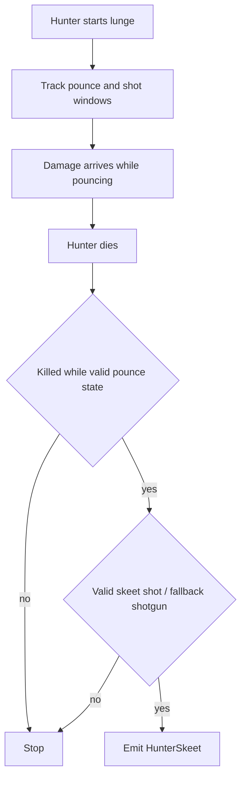
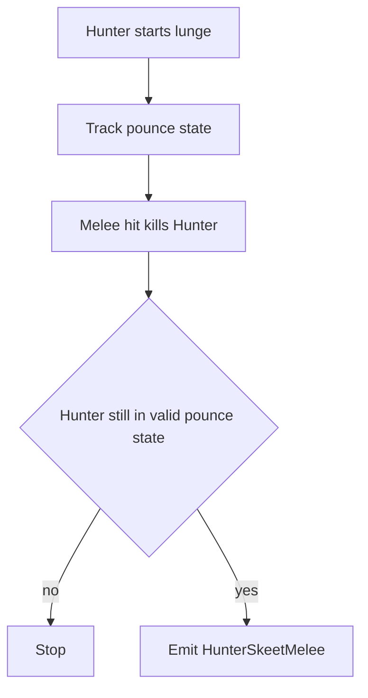
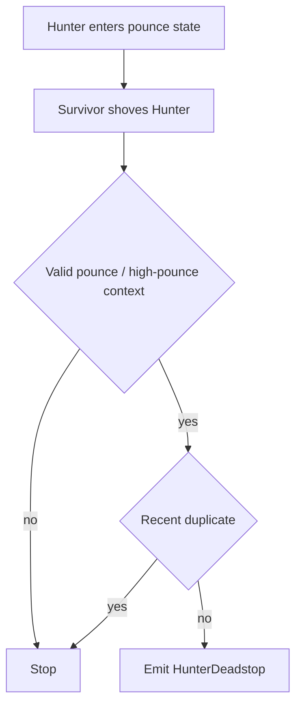
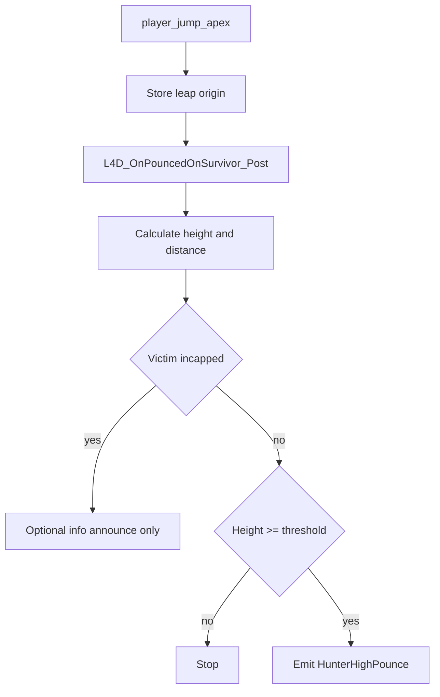

# Hunter Flows

Este documento resume los flujos actuales de skills relacionadas con `Hunter`.

## Skills

- `HunterSkeet`
- `HunterSkeetMelee`
- `HunterDeadstop`
- `HunterHighPounce`

## HunterSkeet

### Sources

- `ability_use`
- `weapon_fire`
- `player_hurt`
- `player_death`
- `SDKHook_OnTakeDamage`
- `SDKHook_OnTakeDamagePost`

`player_hurt` queda solo como contexto complementario. El daño canónico para clasificación de skeets se captura desde `SDKHook_OnTakeDamagePost`.

### State

- `g_bDetectHunterPouncing`
- `g_bDetectShotCounted`
- `g_iDetectHunterSpawnHealth`
- `g_iDetectHunterLastHealth`
- `g_iDetectHunterLastAttacker`
- `g_iDetectHunterLastDamageType`
- `g_iDetectHunterLastHealthBeforeDamage`
- `g_fDetectHunterLastRawDamage`
- `g_iDetectHunterDamage`
- `g_iDetectHunterShots`
- `g_iDetectHunterShotDmgTeam`
- `g_iDetectHunterShotDmg`
- `g_fDetectHunterShotStart`
- `g_iDetectHunterOverkill`
- `g_bDetectHunterKilledPouncing`

### Emit

Se emite `HunterSkeet` cuando:

- el `Hunter` muere durante el `pounce`,
- la kill corresponde al flujo válido de skeet,
- y el golpe final califica como skeet dentro del flujo valido de pounce.

La variante técnica se expresa con propiedades:

- `sniper`
- `grenade_launcher`
- `headshot`
- `perfect`

Whitelist actual de armas para `HunterSkeet`:

- `shotgun`
- `Hunting Rifle`
- `Military Sniper`
- `AWP`
- `Scout`
- `Magnum`
- `Grenade Launcher`

Fuera de esa whitelist, una kill en pounce no debe clasificarse como `HunterSkeet`;
debe caer a `HunterKill`.

Regla de shotgun:

- `shotgun skeet` usa una cvar propia del plugin:
  - `sm_skills_hunter_skeet_interrupt`
- si ese valor queda en `0` o menos, el gate se desactiva;
- en ese modo, cualquier kill válida en `pounce` con arma permitida puede
  clasificarse como `HunterSkeet`, y la calidad se diferencia por
  `perfect/chip/assists`.

Regla visual actual:

- `Skeet` es la habilidad base;
- `Headshot` y `Perfecto` son propiedades;
- si `headshot` y `perfect` coinciden, el announce prioriza `Headshot`;
- el arma visible se imprime como contexto:
  - `con Military Sniper`
  - `con AWP`
  - `con Scout`
  - `con Magnum`
  - `con Grenade Launcher`

### Properties

- `damage`
- `chip_damage`
- `shots`
- `perfect`
- `headshot`
- `sniper`
- `grenade_launcher`

Notas:

- `chip_damage` sigue existiendo como dato tecnico del evento;
- ya no forma parte obligatoria del announce de chat para `HunterSkeet`;
- `damage` y `actor_damage` deben representar daño efectivo de la jugada, no
  `raw damage` inflado del blast final;
- la ventana de `pounce` decide si la jugada califica como `HunterSkeet`;
- el suffix visible `damage/shots` puede resumir el total del actor sobre la
  vida del `Hunter` hasta su muerte, aunque parte de ese total haya ocurrido
  antes del remate técnico;
- eso no cambia la evaluación de `perfect`, `assists` ni `headshot`, que sigue
  dependiendo de la ventana técnica;
- el announce visible usa:
  - `Skeet Headshot ... con {arma}`
  - `Skeet Perfecto ... con {arma}`
  - `Skeet ... con {arma}, asistido por ...`
  - `Skeet ... (damage/shots)` en la ruta no-ranged tradicional

### Flow

### Round End Policy

El timer diferido de muerte de `Hunter` usa política de `hard stop`.

Si la ronda deja de estar `live` antes de que el timer resuelva:

- no se emite `HunterSkeet`;
- no se emite `HunterKill`;
- el flujo se aborta como evento pendiente de una ronda ya cerrada.

## HunterSkeetMelee

### Sources

- `ability_use`
- `player_hurt`
- `player_death`
- `SDKHook_OnTakeDamage`
- `SDKHook_OnTakeDamagePost`

`player_hurt` queda solo como contexto complementario. El daño canónico para clasificación de melee skeets se captura desde `SDKHook_OnTakeDamagePost`.

### State

Comparte el tracking base de `HunterSkeet`, incluyendo:

- estado de `pounce`
- último `raw damage`
- salud previa al golpe
- flag de `perfect`

### Emit

Se emite `HunterSkeetMelee` cuando:

- el `Hunter` muere durante el `pounce`,
- la kill final fue por melee,
- y la jugada cae en la categoría mecánica separada de melee skeet.

Nombre visible:

- `Skeet-Melee`
- si además califica como perfecto:
  - `Skeet-Melee Perfecto`

### Properties

- `damage`
- `chip_damage`
- `assists`
- `perfect`

Notas:

- la ventana de `pounce` sigue decidiendo si hubo `HunterSkeetMelee`;
- cuando el announce imprime `damage/shots`, ese stat visible puede resumir la
  contribución total del actor sobre la vida del `Hunter` que terminó dentro de
  la ventana válida;
- `perfect` sigue exigiendo que no exista chip ni asistencia relevante en la
  ventana técnica.

### Flow

## HunterDeadstop

### Sources

- `L4D2_OnEntityShoved_Post`

### State

- `g_fDetectHunterLastShove`
- `g_bDetectHunterPouncing`
- `g_bDetectLeapOriginSet`
- `g_fDetectLeapOrigin`

### Emit

Se emite `HunterDeadstop` cuando:

- un survivor shovea a un `Hunter`,
- el `Hunter` estaba en `pounce` o en el estado alto relevante,
- y el detector descarta duplicados inmediatos.

### Properties

- `with_shove`
- `reported_high`

### Flow

## HunterHighPounce

### Sources

- `player_jump_apex`
- `L4D_OnPouncedOnSurvivor_Post`

### State

- `g_bDetectLeapOriginSet`
- `g_fDetectLeapOrigin`
- `g_iDetectPinnedVictim`
- `g_iDetectPinnerByVictim`
- `g_iDetectPinnedClass`

### Emit

Se emite `HunterHighPounce` cuando:

- el `Hunter` conecta el `pounce`,
- existe origen de salto válido,
- la víctima no está incapacitada,
- y la altura supera el umbral configurado.

Si la víctima ya estaba incapacitada:

- no se crea `HunterHighPounce`;
- no entra a summary ni API como skill;
- pero puede imprimirse una línea informativa de announce si la altura fue
  suficiente.

### Properties

- `damage`
- `calculated_damage`
- `height`
- `distance`
- `reported_high`

### Flow

### Informational Announce

Cuando el survivor ya estaba incapacitado y el `Hunter` igual conecta desde
altura relevante, el announce actual usa wording informativo:

- `Hunter (X) intento un HighPounce a Y pero se encontraba incapacitado (11 Dmg, 512 Altura).`

Esa línea no representa una skill válida.
