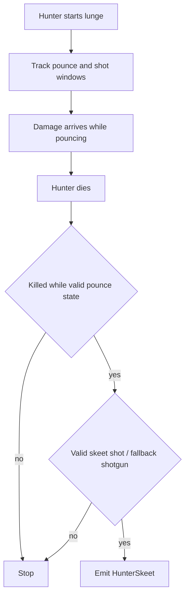
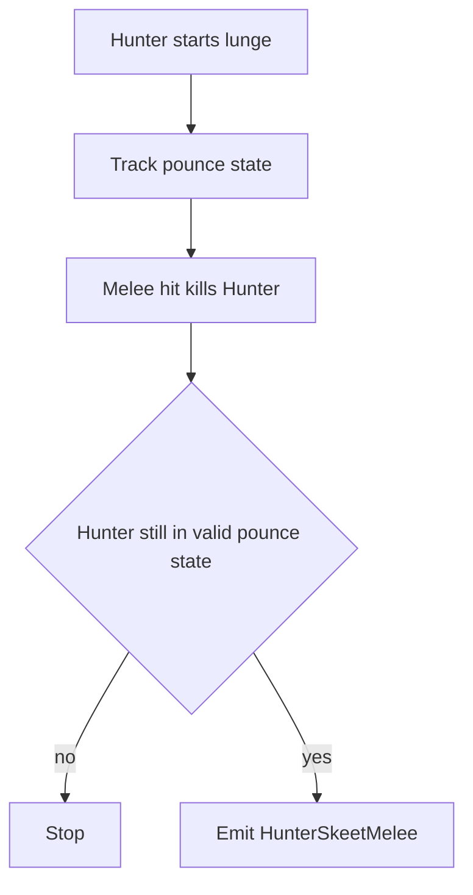
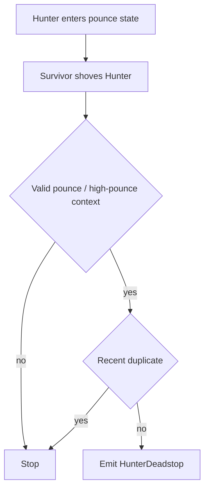
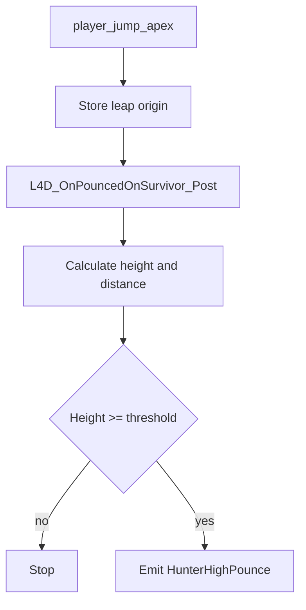

# Hunter Flows

Este documento resume los flujos actuales de skills relacionadas con `Hunter`.

## Skills

- `HunterSkeet`
- `HunterSkeetMelee`
- `HunterDeadstop`
- `HunterHighPounce`

## HunterSkeet

### Sources

- `ability_use`
- `weapon_fire`
- `player_hurt`
- `player_death`
- `SDKHook_OnTakeDamage`
- `SDKHook_OnTakeDamagePost`

`player_hurt` queda solo como contexto complementario. El daño canónico para clasificación de skeets se captura desde `SDKHook_OnTakeDamagePost`.

### State

- `g_bDetectHunterPouncing`
- `g_bDetectShotCounted`
- `g_iDetectHunterSpawnHealth`
- `g_iDetectHunterLastHealth`
- `g_iDetectHunterLastAttacker`
- `g_iDetectHunterLastDamageType`
- `g_iDetectHunterLastHealthBeforeDamage`
- `g_fDetectHunterLastRawDamage`
- `g_iDetectHunterDamage`
- `g_iDetectHunterShots`
- `g_iDetectHunterShotDmgTeam`
- `g_iDetectHunterShotDmg`
- `g_fDetectHunterShotStart`
- `g_iDetectHunterOverkill`
- `g_bDetectHunterKilledPouncing`

### Emit

Se emite `HunterSkeet` cuando:

- el `Hunter` muere durante el `pounce`,
- la kill corresponde al flujo válido de skeet,
- y el golpe final califica como skeet dentro del flujo valido de pounce.

La variante técnica se expresa con propiedades:

- `sniper`
- `grenade_launcher`
- `headshot`

### Properties

- `damage`
- `chip_damage`
- `shots`
- `perfect`
- `headshot`
- `sniper`
- `grenade_launcher`

Notas:

- `chip_damage` sigue existiendo como dato tecnico del evento;
- ya no forma parte obligatoria del announce de chat para `HunterSkeet`;
- el announce visible usa:
  - `PerfectSkeet ... (damage/shots)`
  - `Skeet ... (damage/shots)`
  - `Skeet ... (damage/shots), asistido por ...`

### Flow

## HunterSkeetMelee

### Sources

- `ability_use`
- `player_hurt`
- `player_death`
- `SDKHook_OnTakeDamage`
- `SDKHook_OnTakeDamagePost`

`player_hurt` queda solo como contexto complementario. El daño canónico para clasificación de melee skeets se captura desde `SDKHook_OnTakeDamagePost`.

### State

Comparte el tracking base de `HunterSkeet`, incluyendo:

- estado de `pounce`
- último `raw damage`
- salud previa al golpe
- flag de `perfect`

### Emit

Se emite `HunterSkeetMelee` cuando:

- el `Hunter` muere durante el `pounce`,
- la kill final fue por melee,
- y la jugada cae en la categoría mecánica separada de melee skeet.

### Properties

- `damage`
- `perfect`

### Flow

## HunterDeadstop

### Sources

- `L4D2_OnEntityShoved_Post`

### State

- `g_fDetectHunterLastShove`
- `g_bDetectHunterPouncing`
- `g_bDetectLeapOriginSet`
- `g_fDetectLeapOrigin`

### Emit

Se emite `HunterDeadstop` cuando:

- un survivor shovea a un `Hunter`,
- el `Hunter` estaba en `pounce` o en el estado alto relevante,
- y el detector descarta duplicados inmediatos.

### Properties

- `with_shove`
- `reported_high`

### Flow

## HunterHighPounce

### Sources

- `player_jump_apex`
- `L4D_OnPouncedOnSurvivor_Post`

### State

- `g_bDetectLeapOriginSet`
- `g_fDetectLeapOrigin`
- `g_iDetectPinnedVictim`
- `g_iDetectPinnerByVictim`
- `g_iDetectPinnedClass`

### Emit

Se emite `HunterHighPounce` cuando:

- el `Hunter` conecta el `pounce`,
- existe origen de salto válido,
- y la altura supera el umbral configurado.

### Properties

- `damage`
- `calculated_damage`
- `height`
- `distance`
- `reported_high`
- `incapped`

### Flow

