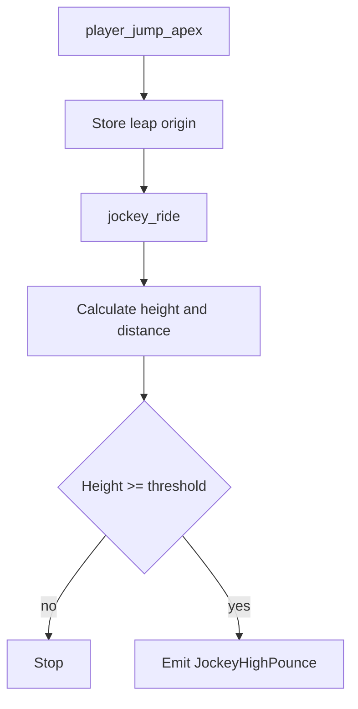

# Jockey Flows

Este documento resume los flujos actuales de skills relacionadas con `Jockey`.

## Skills

- `JockeyHighPounce`

## JockeyHighPounce

### Sources

- `player_jump_apex`
- `jockey_ride`

### State

- `g_bDetectLeapOriginSet`
- `g_fDetectLeapOrigin`
- `g_iDetectPinnedVictim`
- `g_iDetectPinnerByVictim`
- `g_iDetectPinnedClass`

### Emit

Se emite `JockeyHighPounce` cuando:

- el `Jockey` conecta el `ride`,
- existe origen de salto válido,
- y la altura supera el umbral configurado.

### Properties

- `height`
- `distance`
- `reported_high`
- `incapped`

### Flow

