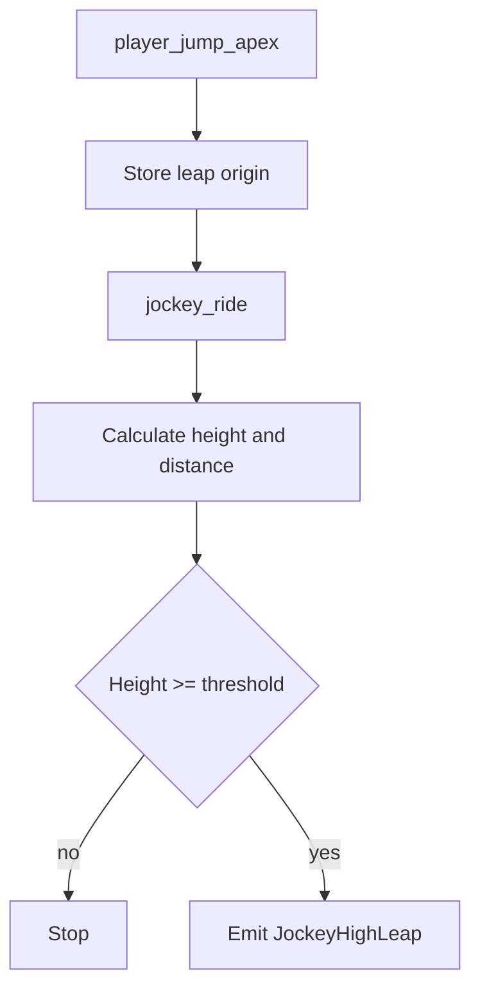
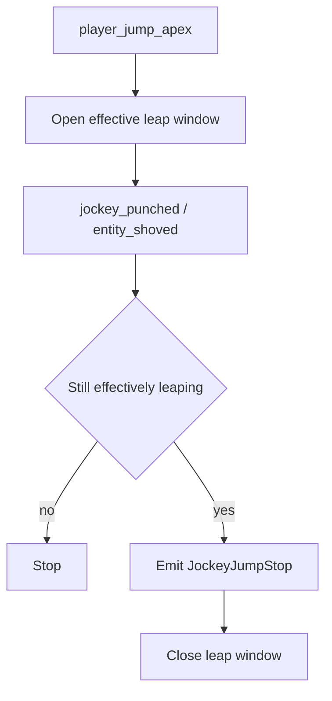
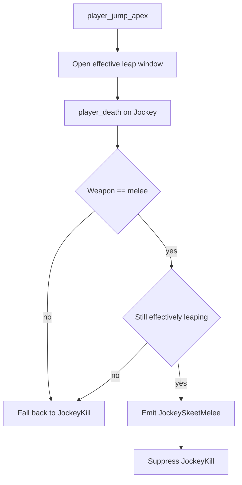
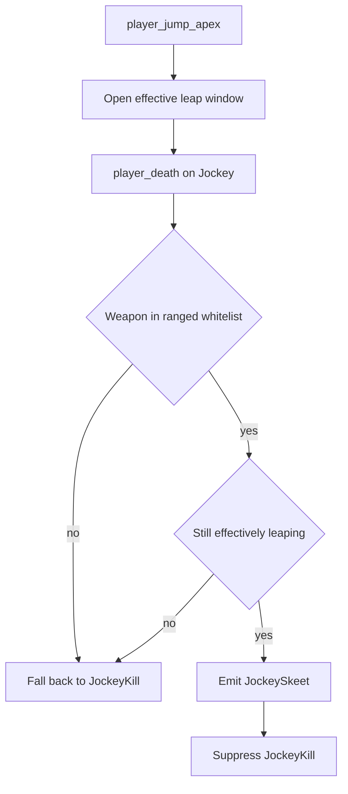

# Jockey Flows

Este documento resume los flujos actuales de skills relacionadas con `Jockey`.

## Skills

- `JockeyHighLeap`
- `JockeyJumpStop`
- `JockeySkeetMelee`
- `JockeySkeet`

## Modelo

Las skills de `Jockey` ahora usan una ventana artesanal de salto ofensivo.

La idea no es depender de `ability_use` como fuente principal, porque ese evento
no es confiable para `Jockey` en todos los entornos.

El flujo actual usa:

- apertura principal por `player_jump_apex`
- cierre por `jockey_ride`
- cierre por shove exitoso
- cierre por muerte

Estado relevante:

- `g_bDetectJockeyLeaping`
- `g_fDetectJockeyLeapSeenAt`
- `g_DetectLeap`
- `g_fDetectJockeyLastShove`

## JockeyHighLeap

### Sources

- `player_jump_apex`
- `jockey_ride`

### State

- `g_bDetectLeapOriginSet`
- `g_fDetectLeapOrigin`
- `g_iDetectPinnedVictim`
- `g_iDetectPinnerByVictim`
- `g_iDetectPinnedClass`

### Emit

Se emite `JockeyHighLeap` cuando:

- el `Jockey` conecta el `ride`,
- existe origen de salto válido,
- y la altura supera el umbral configurado.

### Properties

- `height`
- `distance`
- `reported_high`

### Visible Announce

El wording visible actual usa:

- `Jockey (X) hizo HighLeap a Y (348 Altura).`

La skill sigue siendo `JockeyHighLeap`; `HighLeap` es solo la etiqueta visible del announce.

### Flow

## JockeyJumpStop

### Sources

- `player_jump_apex`
- `jockey_punched`
- `L4D2_OnEntityShoved_Post`

### Emit

Se emite `JockeyJumpStop` cuando:

- el `Jockey` sigue dentro de la ventana efectiva de leap,
- un survivor lo shovea,
- y no se trata de un doble registro dentro de la ventana anti-duplicado.

### Properties

- `with_shove`

### Flow

## JockeySkeetMelee

### Sources

- `player_jump_apex`
- `player_death`
- `SDKHook_OnTakeDamage`
- `SDKHook_OnTakeDamagePost`

### Emit

Se emite `JockeySkeetMelee` cuando:

- el `Jockey` sigue dentro de la ventana efectiva de leap,
- la muerte final ocurre por `melee`,
- y la kill se resuelve antes de que la vida total del `Jockey` se anuncie como `JockeyKill`.

### Properties

- `damage`
- `shots`
- `perfect`

### Flow

## JockeySkeet

### Sources

- `player_jump_apex`
- `player_hurt`
- `player_death`

### Emit

Se emite `JockeySkeet` cuando:

- el `Jockey` sigue dentro de la ventana efectiva de leap,
- la muerte final ocurre por arma ranged válida,
- y la kill se resuelve antes de que la vida total del `Jockey` se anuncie como `JockeyKill`.

Whitelist actual de armas para `JockeySkeet`:

- `shotgun`
- `Grenade Launcher`
- `Hunting Rifle`
- `Military Sniper`
- `AWP`
- `Scout`
- `Magnum`

Reglas:

- `shotgun` puede calificar aunque exista asistencia previa;
- `Grenade Launcher` puede calificar sin `headshot`;
- `snipers` y `Magnum` solo califican cuando el remate final fue `Headshot`;
- no existe variante `Perfecta` para `JockeySkeet`.
- el announce de `JockeySkeet` es independiente de `JockeySkeetMelee`.

### Properties

- `damage`
- `shots`
- `headshot`
- `sniper`
- `grenade_launcher`
- `assists`

### Flow

