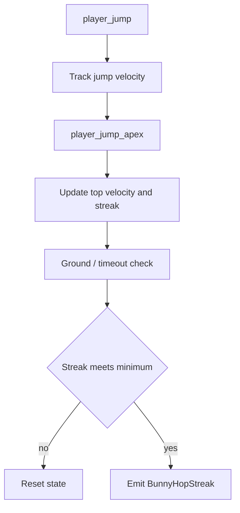
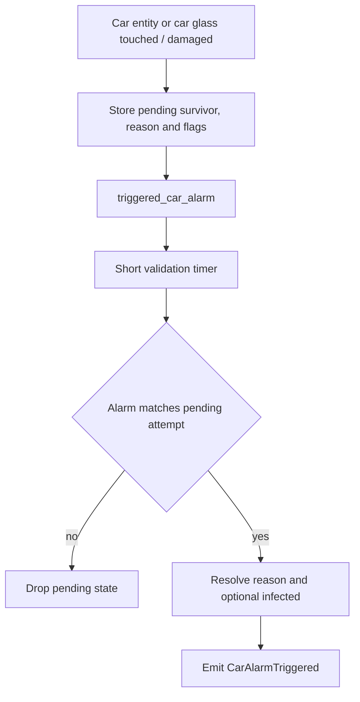

# Misc Flows

Este documento resume los flujos actuales de skills que no pertenecen a una sola familia de infectado.

## Skills

- `BunnyHopStreak`
- `CarAlarmTriggered`

## BunnyHopStreak

### Sources

- `player_jump`
- `player_jump_apex`
- timer de chequeo de hop
- timer de cierre de streak

### State

- `g_bDetectIsHopping`
- `g_bDetectHopCheck`
- `g_iDetectHops`
- `g_fDetectLastHop`
- `g_fDetectHopTopVelocity`

Umbrales:

- `l4d2_player_skills_bhop_streak_min`
- `l4d2_player_skills_bhop_init_speed`
- `l4d2_player_skills_bhop_keep_speed`
- `L4D2_SKILLS_HOP_ACCEL_THRESH`

### Emit

Se emite `BunnyHopStreak` cuando:

- un survivor encadena hops válidos,
- la secuencia termina de forma confirmada,
- y el streak cumple el mínimo configurado.

### Properties

- `streak`
- `max_velocity`

### Flow

## CarAlarmTriggered

### Sources

- `prop_car_alarm`
- `prop_car_glass`
- `SDKHook_OnTakeDamage`
- `SDKHook_Touch`
- `triggered_car_alarm`

### State

- `g_smDetectCarAlarmTargets`
- `g_smDetectCarGlassParents`
- `g_smDetectCarPendingSurvivor`
- `g_smDetectCarPendingReason`
- `g_smDetectCarPendingInfected`
- `g_smDetectCarPendingFlags`
- `g_fDetectLastCarAlarm`

Flags relevantes:

- `indirect`
- `forced`

### Emit

Se emite `CarAlarmTriggered` cuando:

- un survivor interactúa con un auto o con su vidrio asociado,
- el juego confirma la activación de la alarma dentro de la ventana válida,
- y el detector logra resolver la razón inmediata.

El evento puede asociar un infectado responsable cuando el contexto lo justifica:

- `Boomer`
- dominador actual del survivor

### Properties

- `reason`
- `indirect`
- `forced`

Contexto adicional:

- `victim` puede contener el infectado responsable

### Flow

