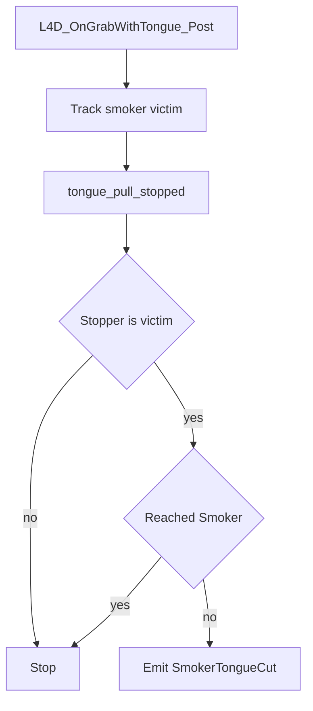
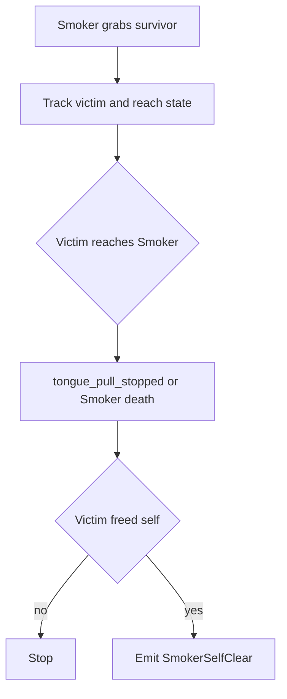
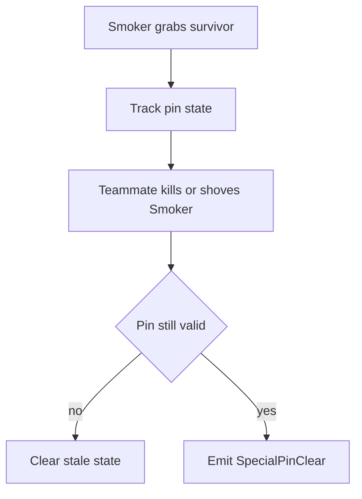

# Smoker Flows

Este documento resume los flujos actuales de skills relacionadas con `Smoker`.

## Skills

- `SmokerTongueCut`
- `SmokerSelfClear`
- `SpecialPinClear` en el contexto de `Smoker`

## SmokerTongueCut

### Sources

- `L4D_OnGrabWithTongue_Post`
- `tongue_pull_stopped`
- `choke_start`

### State

- `g_iDetectSmokerVictim`
- `g_iDetectSmokerOwnerByVictim`
- `g_bDetectSmokerReached`
- `g_bDetectSmokerShoved`

Validación adicional:

- `L4D_HasReachedSmoker`

### Emit

Se emite `SmokerTongueCut` cuando:

- el `Smoker` intentó agarrar al survivor,
- el propio survivor corta o rompe la tongue,
- y el pull todavía no había llegado al `Smoker`.

### Properties

No agrega propiedades especiales hoy.

### Flow

## SmokerSelfClear

### Sources

- `L4D_OnGrabWithTongue_Post`
- `choke_start`
- `tongue_pull_stopped`
- `player_shoved`
- `player_death`

### State

- `g_iDetectSmokerVictim`
- `g_iDetectSmokerOwnerByVictim`
- `g_bDetectSmokerReached`
- `g_bDetectSmokerShoved`

Validación adicional:

- `L4D_HasReachedSmoker`

### Emit

Se emite `SmokerSelfClear` cuando:

- el survivor era la víctima válida del `Smoker`,
- ya había llegado al `Smoker`,
- y se libera a sí mismo:
  - matando al `Smoker`, o
  - shoveándolo.

### Properties

- `with_shove`

### Flow

## SpecialPinClear with Smoker

### Sources

- `L4D_OnGrabWithTongue_Post`
- `choke_start`
- `tongue_pull_stopped`
- `player_shoved`
- `player_death`

### State

- `g_iDetectPinnedVictim`
- `g_iDetectPinnerByVictim`
- `g_iDetectPinnedClass`
- `g_fDetectSpecialClearTimeA`
- `g_fDetectSpecialClearTimeB`

Validación adicional:

- `L4D2_GetSurvivorVictim`
- `L4D2_GetSpecialInfectedDominatingMe`

### Emit

Se emite `SpecialPinClear` en contexto `Smoker` cuando:

- un teammate mata o shovea al `Smoker`,
- el pinned survivor salvado no es el mismo `clearer`,
- y el pin sigue siendo consistente al momento del clear.

### Properties

- `zombie_class`
- `time_a`
- `time_b`
- `with_shove`
- `pinvictim_*`

### Flow

