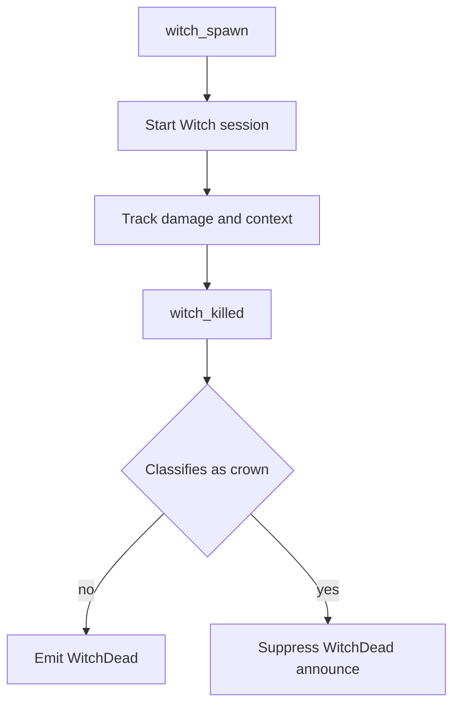
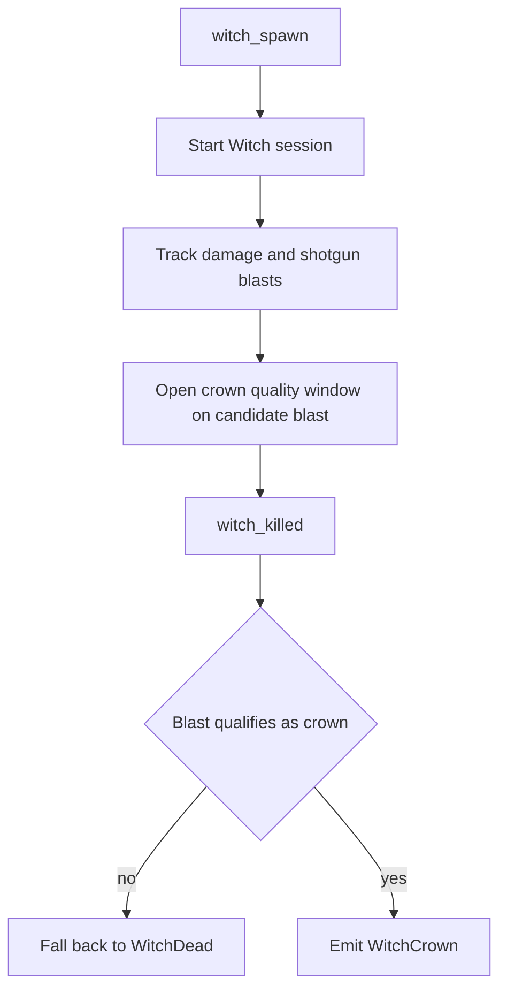
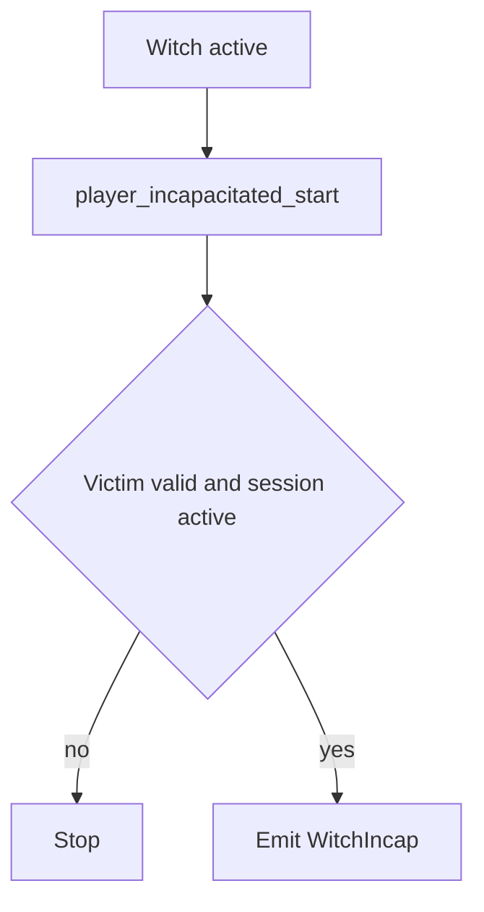

# Witch Flows

Este documento resume los flujos actuales de skills y sesiones relacionadas con `Witch`.

## Skills and Sessions

- `WitchDead`
- `WitchCrown`
- `WitchIncap`
- boss damage sessions de `Witch`

## Witch Damage Session

### Sources

- `witch_spawn`
- `SDKHook_OnTakeDamage`
- `SDKHook_OnTakeDamagePost`
- `witch_killed`
- `player_incapacitated_start`
- `L4D_OnWitchSetHarasser`

### State

- `g_BossSessions`
- `g_BossDamage`
- common session:
  - `maxHealth`
  - `lastHealth`
  - `totalDamage`
- `witch` substate:
  - `startled`
  - `harasser`
  - `incapVictim`
  - `crownDetected`
  - `crowner`
  - `lastHealthBeforeDamage`
  - `lastShotTime`
  - `lastBlastStartTime`
  - `lastShotAttacker`
  - `lastShotDamage`
  - `lastBlastDamage`
  - `lastDamageType`
  - `lastShotIsShotgun`
  - `pendingKillerUserid`
  - `pendingWitchMeleeOnly`
  - `crownQualityWindowActive`

### Modelo

`Witch` usa dos lecturas complementarias:

- `ventana de crown`
  - decide si la muerte clasifica como `WitchCrown`;
  - fija propiedades como `perfect`, `chip_damage` y assists contextuales;
- `vida total de la Witch`
  - conserva el resumen completo de daño del boss;
  - alimenta summaries y `WitchDead`.

Regla central:

- la ventana de crown decide si la jugada es `Crown` o no;
- el suffix visible `damage/shots` puede resumir el total del actor sobre la
  vida de esa `Witch` cuando la muerte se cierra como `WitchCrown`;
- eso no convierte daño previo en daño de la ventana;
- `perfect` sigue dependiendo de una resolución limpia dentro de la ventana.

## WitchDead

### Emit

Se emite `WitchDead` cuando:

- la `Witch` muere,
- existe killer survivor válido,
- y la muerte no clasifica como `WitchCrown`.

### Properties

- `damage`
- `shots`
- `startled`
- `assists`

Notas:

- `WitchDead` representa la muerte normal del boss;
- sus assists y `shots` leen la vida total de la `Witch`, no la ventana de crown;
- el announce visible imprime el summary de daño de la sesión.

### Flow

## WitchCrown

### Emit

Se emite `WitchCrown` cuando:

- la `Witch` muere,
- el killer survivor resuelve el kill final con shotgun,
- y el blast final califica como crown contra el baseline de salud relevante.

### Properties

- `damage`
- `shots`
- `chip_damage`
- `assists`
- `perfect`
- `startled`

Notas:

- la clasificación de `Crown` depende de la ventana del blast final;
- `perfect` requiere una resolución limpia dentro de esa ventana:
  - sin `chip_damage` previo del actor;
  - sin assists;
  - un solo tiro relevante;
  - no `melee_only`;
- el payload conserva separado el contexto previo del actor y de otros survivors;
- el `damage/shots` visible puede resumir el total del killer sobre la vida de
  la `Witch` hasta el cierre del crown.

### Flow

## WitchIncap

### Emit

Se emite `WitchIncap` cuando:

- la `Witch` incapacita a un survivor,
- la sesión de la `Witch` sigue válida,
- y existe víctima survivor válida.

### Properties

- `amount`
- `startled`

Notas:

- `amount` representa la vida restante de la `Witch` al momento del incap;
- si la sesión termina escapada, ese announce de vida restante se omite.

### Flow

